# CLAUDE.md

## 变更日志 (Changelog)

**2025-10-30**: 项目AI上下文初始化完成，添加模块结构图和导航面包屑

---

## 项目概览

DaoDaoRV01 是一个综合性房车租赁平台，作为单体仓库构建，包含四个主要应用程序：

- **后端API** (Node.js + Koa2 + TypeScript) - 核心API服务
- **C端小程序** (uni-app + Vue 3) - 面向用户的应用，支持微信/支付宝/抖音/H5
- **PC管理后台** (Vue 3 + Vite + Element Plus) - 桌面管理界面
- **移动端管理** (uni-app + Vue 3) - 移动管理界面

## 模块结构图

```mermaid
graph TD
    A["(根目录) DaoDaoRV01 房车租赁平台"] --> B["backend - 后端API服务"];
    A --> C["admin-console - PC管理后台"];
    A --> D["miniprogram - C端小程序"];
    A --> E["mobile-admin - 移动端管理"];

    B --> B1["📁 src/controllers - API控制器"];
    B --> B2["📁 src/services - 业务逻辑层"];
    B --> B3["📁 src/entities - 数据实体"];
    B --> B4["📁 src/routes - 路由定义"];
    B --> B5["📁 src/middlewares - 中间件"];
    B --> B6["📁 src/tasks - 定时任务"];
    B --> B7["📁 tests - 测试文件"];

    C --> C1["📁 src/views - 页面视图"];
    C --> C2["📁 src/layouts - 布局组件"];
    C --> C3["📁 src/router - 路由配置"];
    C --> C4["📁 src/components - 组件库"];

    D --> D1["📁 pages - 小程序页面"];
    D --> D2["📁 components - 组件"];
    D --> D3["📁 static - 静态资源"];
    D --> D4["📄 pages.json - 页面配置"];

    E --> E1["📁 pages - 管理页面"];
    E --> E2["📁 components - 组件"];
    E --> E3["📁 static - 静态资源"];
    E --> E4["📄 pages.json - 页面配置"];

    click B "./backend/CLAUDE.md" "查看后端模块文档"
    click C "./admin-console/CLAUDE.md" "查看PC管理后台文档"
    click D "./miniprogram/CLAUDE.md" "查看小程序模块文档"
    click E "./mobile-admin/CLAUDE.md" "查看移动端管理文档"
```



## 模块索引

| 模块路径 | 模块名称 | 技术栈 | 状态 | 描述 |
|---------|---------|--------|------|------|
| `backend/` | 后端API服务 | Node.js + Koa2 + TypeScript | ✅ 运行中 | 核心API服务，处理所有业务逻辑 |
| `admin-console/` | PC管理后台 | Vue 3 + Vite + Element Plus | ✅ 运行中 | 桌面管理界面，用于后台管理 |
| `miniprogram/` | C端小程序 | uni-app + Vue 3 | ✅ 运行中 | 用户端应用，支持多平台 |
| `mobile-admin/` | 移动端管理 | uni-app + Vue 3 | ✅ 运行中 | 移动管理界面，支持移动办公 |

## 核心业务领域

平台管理以下关键业务领域：

- **🚗 车辆管理**: 房车库存、车型管理、维护记录、调度记录
- **👤 用户管理**: 客户账户、实名认证、驾驶证审核、标签管理
- **📋 订单管理**: 预订流程、订单状态、支付处理、退款处理
- **💰 钱包系统**: 用户钱包、积分系统、提现处理、交易记录
- **💳 支付集成**: 微信支付、支付宝支付、退款处理、支付配置
- **🤝 众筹系统**: 投资项目、份额购买、分润计算、车主积分
- **🏕️ 营地管理**: 营地信息、营位管理、预订系统、评价系统
- **🗺️ 旅游管理**: 路线规划、批次管理、团队预订、行程安排
- **🎯 特惠活动**: 促销套餐、限时优惠、活动管理、订单处理
- **🎧 客服系统**: 在线客服、工单系统、快捷回复、会话管理
- **🎫 优惠券**: 优惠券模板、发放管理、使用统计、转赠功能
- **👥 社区功能**: 帖子发布、评论互动、话题管理、举报处理

## 开发命令

### 根目录命令 (单体仓库)
```bash
# 安装所有依赖
npm run install:all

# 代码检查
npm run lint:all
npm run lint:backend
npm run lint:admin
npm run lint:miniprogram
npm run lint:mobile-admin
```

### 后端服务 (backend/)
```bash
cd backend

# 开发环境
npm run dev              # 启动开发服务器，热重载

# 构建和生产
npm run build            # 编译TypeScript
npm start               # 启动生产服务器

# 数据库操作
npm run sync-db         # 同步数据库结构
npm run seed:mock       # 填充模拟数据
npm run migration:generate    # 创建新迁移
npm run migration:run         # 运行待处理迁移
npm run migration:revert      # 回滚最后一次迁移
npm run migration:show        # 显示迁移状态

# 测试
npm test               # 运行测试
npm run test:watch     # 监视模式运行测试
npm run test:coverage  # 运行测试并生成覆盖率报告

# 代码质量
npm run lint           # 检查代码风格
npm run lint:fix       # 修复代码风格问题
npm run format         # 使用Prettier格式化代码
```

### PC管理后台 (admin-console/)
```bash
cd admin-console

# 开发
npm run dev            # 启动Vite开发服务器

# 构建和生产
npm run build          # 构建生产版本
npm run preview        # 预览生产构建

# 代码质量
npm run lint           # 检查代码风格
npm run lint:fix       # 修复代码风格问题
npm run format         # 格式化代码
```

### 小程序和移动端管理 (miniprogram/, mobile-admin/)
这些是uni-app项目，可以使用HBuilderX或CLI开发：

```bash
# 使用CLI (如果可用)
npm run dev:mp-weixin   # 微信小程序
npm run dev:mp-alipay   # 支付宝小程序
npm run dev:mp-toutiao  # 抖音小程序
npm run dev:h5          # H5网页应用

# 构建
npm run build:mp-weixin
npm run build:mp-alipay
npm run build:mp-toutiao
npm run build:h5
```

## 系统架构

### 后端架构
- **框架**: Koa2 + TypeScript
- **数据库**: MySQL 8.0 + TypeORM
- **缓存**: Redis 7.x
- **认证**: JWT令牌
- **实时通信**: Socket.io
- **文件上传**: 阿里云OSS集成
- **支付**: 微信支付 + 支付宝集成

**核心目录**:
- `src/entities/` - TypeORM数据库实体
- `src/controllers/` - API路由处理器
- `src/services/` - 业务逻辑层
- `src/middlewares/` - Koa中间件 (错误处理、认证等)
- `src/utils/` - 工具函数
- `src/tasks/` - 定时后台任务
- `src/routes/` - 路由定义

### 前端架构

**PC管理后台**:
- Vue 3 组合式API + TypeScript
- Vite构建工具
- Element Plus UI框架
- Pinia状态管理
- ECharts数据可视化
- Axios HTTP请求

**小程序** (uni-app):
- Vue 3 + uni-app框架
- uView Plus UI组件库
- Pinia状态管理
- 跨平台支持 (微信、支付宝、抖音、H5)

## 测试策略

后端包含Jest测试设置：
- 服务和工具函数的单元测试
- API端点的集成测试
- 外部依赖的模拟实现
- 测试覆盖率报告可用

从后端目录运行 `npm test` 执行测试。

## 开发指南

### 代码规范
- 使用ESLint + Prettier进行代码格式化
- 启用TypeScript严格模式
- 标识符使用英文，注释使用中文
- 遵循约定式提交规范

### 命名规范
- 组件：帕斯卡命名法 (UserProfile)
- 函数：驼峰命名法 (getUserData)
- 常量：大写下划线命名法 (API_BASE_URL)
- 文件：短横线命名法 (user-profile.vue)

### 环境要求
- Node.js >= 18.0.0
- npm >= 9.0.0
- MySQL 8.0
- Redis 7.x
- Docker (数据库环境可选)

## 常见开发任务

### 添加新API端点
1. 在 `src/entities/` 创建实体
2. 在 `src/services/` 创建服务
3. 在 `src/controllers/` 创建控制器
4. 在 `src/routes/` 添加路由
5. 使用Joi添加验证
6. 编写测试

### 数据库结构变更
1. 创建TypeORM实体或修改现有实体
2. 生成迁移：`npm run migration:generate -n migration-name`
3. 运行迁移：`npm run migration:run`
4. 更新相关服务和控制器

### 添加新小程序页面
1. 在相应的 `pages/` 目录创建 `.vue` 文件
2. 在 `pages.json` 添加路由配置
3. 如需要，在 `components/` 创建组件
4. 使用uni.request添加API调用
5. 测试目标平台

## OpenSpec工作流

本项目使用OpenSpec进行规范驱动的开发。**始终遵循OpenSpec工作流**：

1. **检查现有工作**: `openspec list`, `openspec list --specs`
2. **创建提案**: 针对新功能、破坏性变更、架构更新
3. **验证**: 实施前使用 `openspec validate <change-id> --strict`
4. **实施**: 按顺序完成 `tasks.md` 中的任务
5. **归档**: 部署后使用 `openspec archive <change-id> --yes`

**关键规则**：
- 永远不要跳过提案 → 实施 → 归档流程
- 实施前验证提案
- 归档前完成 `tasks.md` 中的所有任务
- 阅读 `openspec/project.md` 了解项目特定要求

参考 `openspec/AGENTS.md` 获取详细工作流说明。

## AI使用指南

### 沟通语言原则
- **必须使用中文**与用户进行所有沟通和文档编写
- 仅在必要时使用英文（如技术术语、API名称等）
- 内部思考使用英文，但输出必须中文

### Windows编码注意事项
- 当前项目在Windows系统中运行
- 输出中文文档时特别注意编码问题
- 确保文件使用UTF-8编码
- 避免中文字符显示错误或乱码

### OpenSpec使用原则
根据项目特点，必须正确使用OpenSpec：

**适用场景**：
- ✅ 大型项目（当前房车平台）
- ✅ 团队协作开发
- ✅ 复杂业务逻辑功能
- ✅ 需要长期维护的核心功能
- ✅ 涉及支付、订单等关键业务

**工作流程**：
1. **创建提案**：新功能或重大变更必须先创建变更提案
2. **严格验证**：使用 `openspec validate <change-id> --strict`
3. **完整实施**：完成 `tasks.md` 中所有任务清单
4. **规范归档**：部署后使用 `openspec archive <change-id> --yes`

**豁免场景**：
- 简单bug修复
- 文档更新
- 依赖升级（非破坏性）
- 现有功能测试

**核心要求**：
- 永远不要跳过提案→实施→归档流程
- 开始工作前必须验证提案
- 所有任务完成后才能归档
- 始终阅读 `openspec/project.md` 了解项目特定要求